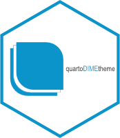

# DIME Quarto Theme 

A DIME theme for Quarto Reveal.js Presentations. **Why Quarto?** Because
it is a cross-language publishing platform that will allow you to create
beautiful HTML presentations with your R or Python code on short notice!
This theme's goal is to allow researchers at the Bank to focus on the content
rather than the form of their presentations by providing a range of sensible
defaults, from the implementation of the official color palette to the inclusion
of a World Bank `{ggplot}` theme. This theme is primarily thought for R users
with the included but `{ggplot}` theme but can also be used with other languages.

See a demo [here](https://dime-worldbank.github.io/quarto-dime-theme/).

## Using this theme:

To use this presentation theme, create a project folder, open a console in that
folder, and run the following command:

```
quarto use template dime-worldbank/quarto-dime-theme
```

This will copy all required stylesheets and templates to your project folder
of the latest version of the template. You can then remove files that you don't
need and edit the `.qmd` presentation to fit your needs.

Note that there are two templates in this collection. You can toggle between
the two by editing the `yaml` header in the `template.qmd` file. Replace
the `dime-revealjs:` by `worldbank-revealjs:` in the `format` key. Alternatively
use and edit the `alt/template_WB.qmd` template directly by copying it to the
root directory of your project.

## Building the presentation:

To build the presentation, simply run `quarto render template_DIME.qmd` from the
same console or open up the `template.qmd` file and hit `CTRL/CMD + K` or the
corresponding shortcut depending on your OS and text editor. This will generate
an `html` file you will be able to present and share with your audience. Check
out the [demo](https://dime-worldbank.github.io/quarto-dime-theme/) for additional ways
of sharing your presentation such as PDFs.

## Useful Resources

Want to go further than this template? Here are some great resources to get you
started with Quarto.

- [Presenting Quarto Slides Documentation](https://quarto.org/docs/presentations/revealjs/presenting.html)
- [The Advanced Quarto/Reveal Documentation](https://quarto.org/docs/presentations/revealjs/advanced.html)
- [A Quarto Tip a Day](https://mine-cetinkaya-rundel.github.io/quarto-tip-a-day/)

Feel free to [open an issue](https://github.com/dime-worldbank/quarto-dime-theme/issues) if
you encounter a bug or want to suggest an improvement of the template. PRs are
welcome too.

## Available Logos:

World Bank and DIME logos can be added by editing the YAML header of the `.qmd`
file. The list of available logos can be found in the `logos` folder of the
theme repository.

```
logos
├── DIME_BLACK.png
├── DIME_COLOR.png
├── DIME_WHITE.png
├── WB-DEC-Impact-horizontal-black-high.png
├── WB-DEC-Impact-horizontal-RGB-high.png
├── WB-DEC-Impact-horizontal-white-high.png
├── WB-WBG-horizontal-black.png
├── WB-WBG-horizontal-grayscale.png
├── WB-WBG-horizontal-RGB.png
└── WB-WBG-horizontal-white.png
```

All logos are subject to copyright and are the exclusive property of DIME
and the World Bank Group.

## PRs and Issues:

Encountered a bug? Want to suggest a feature? Consider describing your issue
[here](https://github.com/dime-worldbank/quarto-dime-theme/issues). If you already have a
solution in mind then know that
[PRs are welcome](https://github.com/dime-worldbank/quarto-dime-theme/pulls).

## Acknowledgements and Disclaimers:

The following creators greatly inspired this theme:

- [The RLadies theme](https://beatrizmilz.github.io/quarto-rladies-theme)
- [The coeos theme](https://github.com/mcanouil/quarto-revealjs-coeos)
- [Hrbrmstr's minimalistic `{ggplot}` themes](https://github.com/hrbrmstr/hrbrthemes)

The Palmer Penguin data used in some of the examples can be found under:

> Horst AM, Hill AP, Gorman KB (2020). palmerpenguins: Palmer Archipelago (Antarctica) penguin data. doi:10.5281/zenodo.3960218, R package version 0.1.0, https://allisonhorst.github.io/palmerpenguins/.

All photos used as examples in the presentation are obtained under
[Pixabay's licence](https://pixabay.com/service/terms/). The train picture can be
found [here](https://pixabay.com/photos/train-railway-snow-winter-railroad-62849/)
and the mountain picture [here](https://pixabay.com/photos/switzerland-sunrise-mountain-clouds-4290226/).

*Disclaimer: The views expressed on this project/website are my own. They do
not represent the views of the World Bank Group.*
